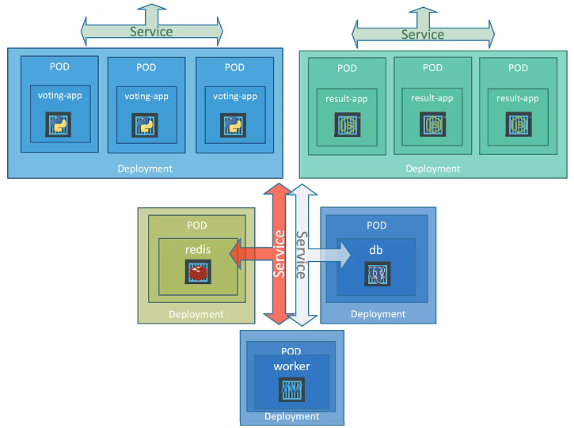

### Terminology

- Node (Worker Node)
    - Physical/virtual machine
    - Called "Minions" in the past
    - Also runs the Kubelet

- Cluster
    - Set of nodes

- Master (Master Node)
    - Special node that manages the worker nodes
    - Also runs the API Server, Controller, Scheduler
    - Stores management data into the etcd

- POD
    - Smallest object that can be created in Kubernetes
    - Executed by a node and runs 1 or more containers
        - Preferred is only 1 container per POD, except there are multiple containers that run different applications, e.g. some helper containers
        - Should aggregate all containers that belong together and have a 1-to-1 relationship and must be started/terminated altogether
    - Containers can communicate via localhost when they are in the same POD

Hierarchy:

- Cluster
    - Nodes
        - Deployment
            - Replica Set
                - PODs
                    - Containers

### Components of Kubernetes

- API Server
    - Front-end
    - User management
- etcd
    - Key-value store
    - Stores data to manage the cluster
    - Stores the data distributed
- Scheduler
    - Responsible to distributing work across multiple nodes
    - Assigns newly created containers and assigns them to nodes
- Controller
    - Notices when nodes or containers go down
    - Makes decision when to bring up new containers
- Container runtime
    - Software that runs containers (e.g. Docker, rkt, cri-o)
- Kubelet
    - Agent on each worker node
    - Makes sure that the containers are running on the nodes as expected

Master Node runs:

- API Server
- etcd
- Controller
- Scheduler

Worker Node runs:

- Kubelet
- Container Runtime

### Replicas

- Replication Controller (deprecated)
    - Older technology which was replaced by Replica Set
    - Able to replicate redundant PODs on single nodes or across all nodes in the same cluster

```yaml
apiVersion: v1
kind: ReplicationController
metadata:
  name: myapp-rc
  labels:
    app: myapp
    type: front-end
spec:
  replicas: 3
  template: # contains everything of a POD yaml except apiVersion and kind
    metadata:
      name: myapp-pod
      labels:
        app: myapp
        type: front-end
    spec:
      containers:
        - name: nginx-container
          image: nginx
```

- Replica Set
    - Same purpose, but more flexible
    - Process that monitors the PODs
    - PODs created by a Replica Set will get the name of the Replica Set from its metadata section
    - If you create more PODs with the same label, manually, that exceed the maximum managed number of replicas, it will be terminated

```yaml
apiVersion: apps/v1
kind: ReplicaSet
metadata:
  name: myapp-replicaset
  ...
spec:
  replicas: 3
  selector: # mandatory property which is not mandatory in Replication Controllers and determines which PODs apply to this Replica Set
    matchLabels:
      type: front-end
  template:
    ...
```

### Deployments

- Groups Replica Sets or PODs that belong together for one release and must later be updated and restarted altogether

```yaml
apiVersion: apps/v1
kind: Deployment
  ...same as ReplicaSet...
```

- Strategies when rolling out new deployment versions:
    - Recreate: terminates everything first, and starts new versions (downtime)
    - Rolling update (default): terminates and recreates one POD by one (no downtime)
    - Green-Blue: is done manually by providing 2 deployments; all traffic is routed to one of them by a service; the other one gets the new
      containers and can be tested; if tests succeed the service switches `selector` to the new label of the other deployment
    - Canary: is done manually by providing 2 deployments; all traffic is routed to one of them by a service; PODs in the old deployment have a
      version label and a common label (e.g. `app:frontend`); new deployment has fewer replicas and they have a different version label and the same
      common label; now we change the `selector` of the service to the common label so that the most traffic is routed to the old deployment and a
      little bit to the new deployment; if the new one works fine we change the service's selected label to the new version label
- Perform rollout by simply:
    - Updating and applying the Kubernetes deployment file: `kubectl apply -f ...`
    - Non-persistent in memory: `kubectl set image deployment/myapp-deployment the-container-name=the-image-name:1.2.3`

### Networking

- Each Node has its IP address
- Each POD has its own IP addresses
- The underlying networking solution makes sure that all PODs have distinct IP addresses even across different deployments

### Services

- For communication between components (are between them)

```
POD <---> Service <---> Database
```

- Types:
    - NodePort: Enables communication via a provided external port to the internal POD's port
        - External port (`nodePort`) forwards to internal service port (`port`)
        - Internal service port (`port`) forwards to internal POD port (`targetPort`)
        - Within the cluster, it has its internal IP (Cluster IP)
        - Valid `nodePort` range: 30000 - 32767
        - Typically used for external access by users
        - The IPs of every node contained by the cluster can be used to access the service (`http://<node-ip>:<nodePort>`)
    - ClusterIP: Creates an internal virtual IP for communication
        - Can be accessed by other PODs by the cluster IP or the service name
        - Typically used for internal access between services
    - LoadBalancer: Proxy which allows to communicate with distributed nodes
        - Use case as for NodePort
        - Is preferred in production environments

```yaml
apiVersion: v1
kind: Service
metadata:
  ...
spec:
  type: NodePort # or the others
  ports:
    - targetPort: 80 # if omitted, the same as port
      port: 80
      nodePort: 30008 # if omitted, random port
  selector: # labels from the deployment template
    - app: myapp
      tier: front-end
```

```yaml
apiVersion: v1
kind: Service
...
spec:
  type: ClusterIP # default type
  ports:
    - targetPort: 80
      port: 80
  selector:
    - app: myapp
      tier: back-end
```

To get available URL for accessing on minikube: `minikube service myapp-serivce --url`

### Networking with Ingress

The cloud platform provides a static load-balancer IP/hostname in front of your LoadBalancer Service type. Theoretically, for each LoadBalancer
Service you need another cloud platform load-balancer (which increases costs).

Instead of that approach, you usually introduce:

- Ingress Controller: Network entrypoint of your web application for the users
- Ingress Resources: Configuration for Ingress

Available Ingress Controller implementations:

- Google Cloud Platform (GCP) Load Balancer
- Nginx
- Istio

```yaml
apiVersion: apps/v1
kind: Deployment
metadata:
  name: nginx-ingress-controller
spec:
  selector:
    matchLabels:
      name: nginx-ingress
  template:
    metadata:
      labels:
        name: nginx-ingress
    spec:
      containers:
        - name: nginx-ingress-controller
          image: quay.io/kubernetes-ingress-controller/nginx-ingress-controller:0.21.0
          args:
            - /nginx-ingress-controller
            - --configmap=$(POD_NAMESPACE)/nginx-configuration
          env:
            - name: POD_NAME # name of the POD which contains the service to be forwarded to
              valueFrom:
                fieldRef:
                  fieldPath: metadata.name
            - name: POD_NAMESPACE
              valueFrom:
                fieldRef:
                  fieldPath: metadata.namespace
          ports:
            - name: http
              containerPort: 80
            - name: https
              containerPort: 443
```

```yaml
apiVersion: v1
kind: ConfigMap
metadata:
  name: nginx-configuration
```

```yaml
apiVersion: v1
kind: Service
metadata:
  name: nginx-ingress
spec:
  type: NodePort
  ports:
    - port: 80
      targetPort: 80
      protocol: TCP
      name: http
    - port: 443
      targetPort: 443
      protocol: TCP
      name: https
  selector:
    name: nginx-ingress
```

```yaml
apiVersion: v1
kind: ServiceAccount
metadata:
  name: nginx-ingress-serviceaccount
  # Nginx potentially needs these two: ingress-nginx, ingress-nginx-admission
```

```yaml
# that's the Ingress Resource
apiVersion: networking.k8s.io/v1
kind: Ingress
metadata:
  name: ingress-app1
  #annotations:
  # if we wanna change the path of the URL to another one when forwarding to the particular service:
  #  nginx.ingress.kubernetes.io/rewrite-target: /
  # if we wanna disable redirect to HTTPS:
  #  nginx.ingress.kubernetes.io/ssl-redirect: "false"
spec:
  rules:
    - host: sub.domain.com # optional if it must be restricted on specific domain (default: *)
      http:
        paths:
          - pathType: Prefix
            path: /foo(/|$)(.*)
            backend:
              service:
                name: foo-service
                port:
                  number: 8080
          - pathType: Prefix
            path: /bar(/|$)(.*)
            backend:
              service:
                name: bar-service
                port:
                  number: 8080
```

### Network Security

"Ingress" means incoming traffic to a service, "Egress" represents outgoing traffic from a service.

By default, all PODs can communicate with each other. A Network Policy allows to specify which POD is allowed to communicate with another POD.

```yaml
apiVersion: networking.k8s.io/v1
kind: NetworkPolicy
metadata:
  name: database-policy
spec:
  podSelector:
    matchLabels:
      app: database # labels of the POD where this policy must apply to
  policyTypes:
    - Ingress # incoming/outcoming/both traffic - following ingress/egress settings only take effect when they are mentioned in "policyTypes"
    # every type that is not mentioned here, won't be allowed - in this case: no outgoing calls by the database POD are allowed
  ingress:
    - from: # labels of PODs that are allowed to communicate with it
        - podSelector:
            matchLabels:
              app: api-service
          namespaceSelector: # optional - if you wanna restrict the traffic only on a particular namespace
            matchLabels:
              name: prod
        - ipBlock: # optional logical OR which also allows access from particular IP addresses
            cidr: 192.168.5.10/32
        - namespaceSelector: # optional logical OR which also allows access from particular namespace
            matchLabels:
              name: dev
      ports:
        - protocol: TCP
          port: 3306
  #egress:
  #  - to:
  #      ...
```

### Namespaces

May be used to separate between testing and production environment. To access hostname of service `database` of the namespace `dev`, it has the
following URL:

```database.dev.svc.cluster.local```

`database`: the `type=service` name

`dev`: namespace

`svc`: service

`cluster.local`: domain

To list PODs that are in another namespace than `default`:

```shell
kubectl get pods --namespace=dev
```

List PODs of all namespaces:

```shell
kubectl get pods --all-namespaces
```

List PODs and filter by labels:

```shell
kubectl get pods --selector app=App1 --selector env=dev
```

To apply a manifest file on another namespace than `default`:

```shell
kubectl apply -f pod.yml --namespace=dev
```

Or put the namespace into the metadata of the manifest:

```yaml
...
metadata:
  ...
  namespace: dev
...
```

Create a namespace:

```yaml
apiVersion: v1
kind: Namespace
metadata:
  name: dev
```

Or on command line:

```shell
kubectl create namespace dev
```

Permanently switch the used namespace to be used by `kubectl`:

```shell
kubectl config set-context $(kubectl config current-context) --namespace=dev
```

### Resource Quota

Used to limit resource usage.

```yaml
apiVersion: v1
kind: ResourceQuota
metadata:
  name: compute-quota
  namespace: dev
spec:
  hard:
    pods: "10"
    requests.cpu: "4"
    requests.memory: 5Gi
    limits.cpu: "10"
    limits.memory: 10Gi
```

### Config Map

Stores key-value pairs that can be referenced in other manifests.

```yaml
apiVersion: v1
kind: ConfigMap
metadata:
  name: app-config
data:
  KEY1: "value1"
  KEY2: "value2"
```

```shell
kubectl get configmaps

kubectl describe configmap ap-config
```

### Secret

Like Config Map, but to store sensitive data in encoded (not encrypted) form.

```yaml
apiVersion: v1
kind: Secret
metadata:
  name: database-config
data:
  KEY1: "value1 as Base64"
  KEY2: "value2 as Base64"
```

```shell
kubectl get secrets

kubectl describe secret database-config # with all values hidden
kubectl describe secret database-config -o yaml # with all values shown
```

To encrypt secrets, see this guideline: https://kubernetes.io/docs/tasks/administer-cluster/encrypt-data/

For save storage of secrets: Helm Secrets, HashiCorp Vault

### Service Account

Account that is used by a machine/software to interact somewhere.

```shell
kubectl create serviceaccount dashboard-sa
```

### Limit Range

General hardware resource settings for all PODs (see POD-specific settings in POD manifest at `resources`).

```yaml
apiVersion: v1
kind: LimitRange
metadata:
  name: cpu-resource-constraints
spec:
  limits:
    - type: container
      default:
        cpu: 500m # means "milli" - same like 0.5
        memory: 1Gi
      defaultRequest:
        cpu: 500m
        memory: 1Gi
      max:
        cpu: "1"
        memory: 1Gi
      min:
        cpu: 100m
        memory: 500Mi
```

### Resource Quota

Overall hardware resource limits.

```yaml
apiVersion: v1
kind: ResourceQuota
metadata:
  name: my-resource-quota
spec:
  hard:
    requests.cpu: 4
    requests.memory: 4Gi
    limits.cpu: 10
    limits.memory: 10Gi
```

### Taints and Tolerations

If a node is tainted, only PODs that tolerate that taint can be placed on it. But those PODs are not enforced to be placed on them.

```shell
kubectl taint nodes node-name key=value:taint-effect
```

- `key=value`: Label a node must have to tolerate that node

- `taint-effect`:
    - `NoSchedule`: POD which doesn't tolerate the `value` will not be scheduled on that tainted node
    - `PreferNoSchedule`: Intolerant POD will not be scheduled, but it's not guaranteed
    - `NoExecute`: Intolerant PODs will not be scheduled and already running intolerant PODs will be removed

Indicating what to tolerate in a POD:

```yaml
apiVersion: v1
kind: Pod
...
spec:
  tolerations:
    - key: "value" # all values must necessarily be in quotes
      operator: "Equal"
      value: "blue"
      effect: "NoSchedule"
  ...
```

### Node Selectors and Node Affinity

Allows to specify on POD-side, on which node they are allowed to be run.

```shell
kubectl label nodes node-name key1=value1
```

```yaml
apiVersion: v1
kind: Pod
...
spec:
  nodeSelector:
    key1: value1
  ...
```

For more complex node selection, there's Node Affinity feature:

```yaml
apiVersion: v1
kind: Pod
...
spec:
  affinity:
    nodeAffinity:
      requiredDuringSchedulingIgnoredDuringExecution:
        nodeSelectorTerms:
          - matchExpressions:
              - key: size
                operator: In
                values:
                  - Large
                  - Medium
```

Possible values for affinity:

- `requiredDuringSchedulingIgnoredDuringExecution`
    - `requiredDuringScheduling`: Only place the POD on a node when there's a matching node
    - `IgnoredDuringExecution`: Do nothing if POD is already running on a non-matching node
- `preferredDuringSchedulingIgnoredDuringExecution`
    - `preferredDuringScheduling`: Place the POD on the matching node, or any node if nothing matches
    - `IgnoredDuringExecution`: See above
- `requiredDuringSchedulingRequiredDuringExecution`
    - `requiredDuringScheduling`: See above
    - `RequiredDuringExecution`: If a node gets a non-matching label, all already running nodes that don't match will be killed

Difference between Taints/Tolerations and Node Affinity:

- Taints/Tolerations make sure that only explicitly accepted PODs are executed
    - Nodes select PODs
    - But it doesn't guarantee that these PODs are only run on that nodes
- Node Affinity makes sure that POD only explicitly select specific nodes
    - PODs select nodes
    - But it doesn't guarantee that only desired PODs are run on them

use case: there are dedicated nodes for specific teams. A combination of both make sure that team nodes only run PODs from that team.

### Jobs

Are intended to run one time and completes after doing something. They are not restartedby Kubernetes after completing.

```yaml
apiVersion: batch/v1
kind: Job
metadata:
  name: math-job
spec:
  template:
    spec:
      containers:
        - name: math-add
          image: ubuntu
          command: [ "expr", "2", "+", "3" ]
      restartPolicy: Never
```

### Cronjobs

For repeated job execution.

```shell
# ┌──────── minute (0 - 59)
# │ ┌──────── hour (0 - 23)
# │ │ ┌──────── day (1 - 31)
# │ │ │ ┌──────── month (1 - 12)
# │ │ │ │ ┌──────── week day (0 - 6) (Sunday - Saturday)
# │ │ │ │ │                       7 Sunday (on some systems)
# * * * * *
```

```yaml
apiVersion: batch/v1
kind: CronJob
metadata:
  name: math-job
spec:
  schedule: "*/1 * * * *"
  jobTemplate:
    spec:
      completions: 3
      template:
        spec:
          containers:
            - name: math-add
              image: ubuntu
              command: [ "expr", "2", "+", "3" ]
          restartPolicy: OnFailure
```

### Volumes

On DigitalOcean, you create a persistent volume via the UI and specify a `PersistentVolumeClaim`.

```yaml
apiVersion: v1
kind: PersistentVolume
metadata:
  name: pv-vol1
spec:
  accessModes:
    - ReadWriteOnce
  capacity:
    storage: 1Gi
  persistentVolumeReclaimPolicy: Delete # optional (default: "Retain"): "Delete" determines that it's deleted when the Claim was removed (the default 
  # doesn't touch it); "Recycle" reuses that value but clears it beforehand when it's getting reused

  # option 1: only reasonable for local development
  hostPath:
    path: /tmp/data

  # option 2: preferred for production environment on DigitalOcean
  storageClassName: do-block-storage # default Persistent Volume on DigitalOcean - replace it for a custom one
  csi:
    driver: dobs.csi.digitalocean.com
    volumeHandle: <volume-id>  
```

Possible access modes:

- `ReadOnlyMany`: Read only mode across all nodes (not supported by DigitalOcean)
- `ReadWriteOnce`: One single node is only allowed to have read/write access by the contained PODs on that node
- `ReadWriteMany`: Read/write access across all nodes (not supported by DigitalOcean)
- `ReadWriteOncePod`: Only at most one POD across the whole cluster has read/write access

To use the storage (`PersistentVolume`) created by an administrator, the users (developers) create a `PersistentVolumeClaim`. Relationship between
Volume and Claim: 1 to 1. Per Claim, you need a dedicated Volume.

```yaml
apiVersion: v1
kind: PersistentVolumeClaim
metadata:
  name: myclaim
spec:
  accessModes:
    - ReadWriteOnce
  resources:
    requests:
      storage: 500Mi
  selector: # optional
    matchLabels:
      name: database-volume
```

For PODs with persistent data (e.g. database), use `StatefulSet` in place of `Deployment`.

If you apply a Claim, Kubernetes tries to find an existing Volume that matches the Claim's requirements (access mode, size).

### Stateful Set

Similar to Deployment (rolling updates, scaling), but intended for use cases where data must be stored persistently. Differences:

- If scaled, PODs are deployed sequentially and not in parallel
- On initial start-up, each POD clones the persistent data of its previous POD of the start-up order

The manifest file is the same as for Deployment, but with different `kind` and additional properties:

```yaml
apiVersion: apps/v1
kind: StatefulSet
metadata:
  name: mysql # future names of the replicated PODs: mysql-0, mysql-1, mysql-2, ...
  labels:
    app: mysql
spec:
  serviceName: mysql-h # name of the headless service
  selector:
    matchLabels:
      app: mysql

  replicas: 3
  template:
    metadata:
      labels:
        app: mysql
    spec:
      containers:
        - name: mysql
          image: mysql
  volumeClaimTemplates: # in order to automatically create a separate volume per replica 
    - metadata:
        name: data-volume
      spec:
        accessModes:
          - ReadWriteOnce
        ...
```

Headless service: special kind of service which doesn't perform load balancing, but assigns static domain names to pods:

```
podname.headless-servicename.namespace.svc.example.com
```

For example for local: `mysql-0.mysql-h.default.svc.cluster.local`

In case of StatefulSets, the names are like: `mysql-0.mysql-h.default.svc.cluster.local` (master service),
`mysql-1.mysql-h.default.svc.cluster.local`, ...

```yaml
apiVersion: v1
kind: Service
metadata:
  name: mysql-h
spec:
  ports:
    - port: 3306
  selector:
    app: mysql
  clusterIP: None
```

And the POD manifest must have this property matching the headless service's name:

```yaml
...
spec:
  subdomain: mysql-h
  hostname: mysql-pod
```

This in total creates: `mysql-0.mysql-h.default.svc.cluster.local`, ...

### Design approach



- Specify POD files for each service
    - typical labels: `name` (can match name of the POD), `app` (title of the application), `tier`/`function` (purpose of POD)
- Create Service files for each service that gets accessed internally or externally
    - For internal service access chose type `ClusterIP` (default) and specify `targetPort` and `port` with the same value as the exposed port of
      the service
    - For external service access chose type `NodePort` and specify `targetPort` and `port` with the same value as the exposed port of the service
      and add `nodePort` with the desired port to be exposed for external access
    - The name of the Service should match the expected hostname for the connection (e.g. `mysql` for `jdbc:mysql://mysql:3306`)
    - In production (and if supported), you can replace the Service type `NodePort` of your external services to `LoadBalancer`
- Create one or more deployment files
    - Aggregate what belongs together and always must be rolled out altogether
    - Consider that this doesn't mean that you group a service and a database application into one single POD or respectively one single deployment
      (always think about replicas: is it reasonable to have more than one replica for that POD with that containers in it?)
    - Services are not wrapped into a Deployment
- For PODs with persistent data (e.g. database), use `StatefulSet` in place of `Deployment`.

Examples for multi-container PODs:

- Sidecar pattern
    - 2 containers: Service and log agent (who forwards logs to a central log server)
- Adapter pattern
    - 2 containers: Service and log preprocessor which normalizes different logging formats before sending to a server
- Ambassador pattern
    - 2 containers: Service and proxy service which communicates with the right database depending on the underlying context (prod, dev, test)

### Local setup

- Install `kubectl` as described on http://kubernetes.io/

### Management of applications

Via command line tool `kubectl`.

Fast w/o YAML:

```shell
# namespace
kubectl create namespace dev

# POD
kubectl run depl-name --image=image-name

# service
kubectl expose pod depl-name --port=8080 --name=service-name

# deployment
kubectl create deployment dep-name --image=image-name --replicas=4

# config map
kubeclt create configmap the-cfg-name --from-literal=KEY1=value1  --from-literal=KEY2=value2
kubeclt create configmap the-cfg-name --from-file=file.properties

# secret
kubectl create secret generic the-cfg-name --from-literal=KEY1=value1  --from-literal=KEY2=value2
kubectl create secret generic the-cfg-name --from-file=file.properties
```

Deploy application:

```shell
kubectl run hello-minikube

  or

kubectl run arbitrary-deployment-name --image=hello-minikube
```

Show cluster information:

```shell
kubectl cluster-info
```

List all nodes of a cluster:

```shell
kubectl get nodes
```

List all PODs of a node:

```shell
kubectl get pods

kubectl get pods -o wide
```

More information of one POD:

```shell
kubectl describe pod deployment-name 
```

Remove a POD:

```shell
kubectl delete pod deployment-name
```

List all Replication Controllers:

```shell
kubectl get replicationcontrollers
```

List all Replica Sets:

```shell
kubectl get replicaset

  or

kubectl get rs
```

List all Deployments:

```shell
kubectl get deployments
```

View deployment rollout status of ongoing rollout:

```shell
kubectl rollout status deployment my-deployment
```

View deployment revisions:

```shell
kubectl rollout history deployment my-deployment
```

Revert latest deployment rollout to previous version:

```shell
kubectl rollout undo deployment myapp-deployment
```

Edit the Yaml of a running Replicate Set (or something else) on runtime in memory (change is not persistent):

```shell
kubectl edit replicaset the-rep-set-deployment-name

  or for specific property:

kubectl scale replicaset the-rep-set-deployment-name --replicas=5
```

Create something w/o yaml file, e.g. Deployment:

```shell
kubectl create deployment the-name --image=the-base-image --replicas=3
```

View services:

```shell
kubectl get services
```

List desired objects at the same time:

```shell
kubectl get pods,services
```

List all objects of the cluster:

```shell
kubectl get all
```

Output the basic manifest for an object:

```shell
kubectl run my-name --image=nginx --dry-run -o yaml
```

Not only for `run`, works for the otter commands as well. `-o` describes the output format: `yaml`, `json`, `wide` (more details), `name` (only
resource name).

### Kubernetes files

Namespace:

```yaml
apiVersion: v1
kind: Namespace
metadata:
  name: dev
```

POD:

```yaml
apiVersion: v1
kind: Pod
metadata:
  name: myapp-pod
  labels: # can contain any arbitrary key-values
    app: myapp
    type: front-end
  annotations: # can be used for version information and can have arbitrary key-values
    buildVersion: 1.0.23

spec:
  initContainers: # executed before "containers" - when they terminate, the actual containers will be started
    - name: init-myservice
      image: busybox:1.28
      command: [ 'sh', '-c', 'until nslookup myservice; do echo waiting for myservice; sleep 2; done;' ]
  containers:
    - name: nginx-container
      image: nginx
      ports:
        - containerPort: 80 # port to be exposed to the internal container network
      env: # for environment variables to be set
        - name: DATABASE_USER
          value: "ADMIN"
        - name: DATABASE_PORT # obtain value from a separate config map
          valueFrom:
            configMapKeyRef:
              name: mysql-initdb-config
              key: PORT
        - name: DATABASE_PWD # obtain value from a separate secret
          valueFrom:
            secretKeyRef:
              name: secrets-config
              key: PASSWORD
      args: [ "10" ] # in Dockerfile, gets appended to the entrypoint: ENTRYPOINT ["sleep"] -> ENTRYPOINT ["sleep", "10"]
      command: [ "ownsleep" ] # represents the "--entrypoint" option when running the Dockerfile via Docker and overrides ENTRYPOINT
      securityContext:
        runAsUser: 1000 # to execute the entrypoint with different user than root
        capabilities: # for adding additional rights
          add:
            - MAC_ADMIN
      envFrom: # injects config maps by their names with their key-value pairs as environment variables
        - configMapRef:
            name: mysql-initdb-config
        - secretRef:
            name: secrets-config
      resources:
        requests: # to specify minimum hardware requirements of the node
          memory: "4Gi"
          cpu: 2 # number of cores
        limits: # to specify maximum hardware to be consumed
          memory: "5Gi"
          cpu: 3
      readinessProbe: # check on startup when underlying service is really ready and responsive
        initialDelaySeconds: 10
        periodSeconds: 5
        failureThreshold: 8 # number of consecutive probe failures until everything is aborted
        httpGet: # for HTTP
          port: 8080
          path: /api/ready
        tcpSocket: # for TCP
          port: 3306
        exec: # for script
          command:
            - cat
            - /app/is_ready
      livenessProbe: # periodic check during runtime of the container
        # same properties as for "readinessProbe"
        httpGet:
          port: 8080
          path: /api/healthy
      volumeMounts:
        - mountPath: /path/in/container
          name: my-persistent-data
  volumes:
    - name: mysql-config-volume
      configMap:
        name: mysql-initdb-config
    - name: secret-volume # if you wanna store the secrets in a separate volume
      secret: # each key is stored as a file which contains the value
        secretName: secrets-config
    - name: my-persistent-data # to store something on a persistent volume
      persistentVolumeClaim:
        claimName: my-claim # set name of the "PersistentVolumeClaim"
    - name: log-volume # to map a volume into the node's host
      hostPath:
        path: /var/log/webapp
  tolerations: # specifies which tainted nodes they accept
    - key: "value" # all values must necessarily be in quotes
      operator: "Equal"
      value: "blue"
      effect: "NoSchedule"
  nodeSelector:
    size: Large # key and value represent a node label
  affinity: # for more complex conditions than in "nodeSelector"
    nodeAffinity:
      requiredDuringSchedulingIgnoredDuringExecution:
        nodeSelectorTerms:
          - matchExpressions:
              - key: size
                operator: In
                values:
                  - Large
                  - Medium
```

Deployment:

```yaml
apiVersion: apps/v1
kind: Deployment
metadata:
  name: front-end-deployment
  labels:
    app: myapp
    type: myapp-deployment
spec:
  replicas: 3
  selector:
    matchLabels:
      type: front-end
  template:
    metadata:
      name: myapp-pod
      labels:
        app: myapp
        type: front-end
    spec:
      containers:
        - name: nginx-container
          image: nginx
```

Service:

```yaml
apiVersion: v1
kind: Service
metadata:
  name: front-end-service
  labels:
    app: myapp
    type: myapp-service
spec:
  type: NodePort
  ports:
    - targetPort: 80
      port: 80
      nodePort: 30008
  selector: # labels from the deployment template
    - app: myapp
      tier: front-end
```

Config Map:

```yaml
apiVersion: v1
kind: ConfigMap
metadata:
  name: app-config
data:
  KEY1: "value1"
  KEY2: "value2"
```

Secret:

The same as Config Map, but with `kind=Secret` and all key values in Base64-encoded form.

```shell
echo -n "value1" | base64
echo -n "bX1zcWw==" | base64 --decode
```

```yaml
KEY1: bX1zcWw==
```

Job:

```yaml
apiVersion: batch/v1
kind: Job
metadata:
  name: math-job
spec:
  completions: 3 # optional (default: 1): the number of restarts after successful completion (on error additional restart)
  parallelism: 3 # optional (default: 1): for non-sequential execution as specified by "completions"
  template:
    spec:
      containers:
        - name: math-add
          image: ubuntu
          command: [ "expr", "2", "+", "3" ]
      restartPolicy: Never
```

CronJob:

```yaml
apiVersion: batch/v1
kind: CronJob
metadata:
  name: math-job
spec:
  schedule: "*/1 * * * *"
  jobTemplate:
    spec:
      completions: 3
      template:
        spec:
          containers:
            - name: math-add
              image: ubuntu
              command: [ "expr", "2", "+", "3" ]
          restartPolicy: OnFailure
```

Apply manifest to Kubernetes:

```shell
kubectl create -f pod-definition.yml

  or

kubectl apply -f pod-definition.yml
```

`apply` updates changed properties in running deployments, but doesn't remove deleted properties.

`replace` recreates existing deployments and also removes deleted properties as specified by the yaml.

Apply all Kubernetes files in the folder:

```shell
kubectl apply -f .
```

Show logs of a single-container POD:

```shell
kubectl logs -f pod-name
```

Show logs of a multi-container POD:

```shell
kubectl logs -f pod-name container-name
```

Shorthand for `delete` followed by `apply`:

```shell
kubectl replace --force -f definition.yml
```

### Helm

- Some kind of package manager for Kubernetes
- Allows to declare entire installation packages of my application which contains all objects and allows to configure them

```shell
helm install [release-name] [chart-name]
helm upgrade poc ...
helm rollback poc ...
helm uninstall [release-name] [chart-name]

helm search hub wordpress # search for wordpress
helm list # to list installations

helm pull --untar bitnami/wordpress # to download only
helm install release-4 ./wordpress # to install from the extracted folder
```

Install Helm: https://helm.sh/docs/intro/install/

Prepare installation package (called "Helm Chart") of a custom application:

- Convert the YAML files into templates and move them into a `templates/` folder
    - Variable values like `- image: wordpress:4.8-apache` can be converted into variables like `- image: {{ .Values.image }}`
- Variables are stored to a `values.yaml` with default values:

```yaml
image: wordpress:4.8-apache
```

- Create `Chart.yaml` file with meta information about the Helm Chart itself:

```yaml
apiVersion: v2
name: Wordpress
version: 9.0.3
description: ...
keywords:
  - wordpress
  - cms
home: http://www.wordpress.com/
sources:
  - https://github.com/...
maintainers:
  - name: Bitnami
    email: info@example.com
```

Official repository for Helm Charts: https://artifacthub.io/

Install something: `helm install release-3 bitnami/wordpress`