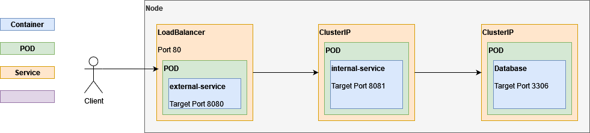

# Kubernetes PoC

Consists of: external service, internal service, database



## Run on Kubernetes

### Install the Nginx Ingress Controller:

```shell
helm repo add ingress-nginx https://kubernetes.github.io/ingress-nginx
helm repo update
helm install nginx-ingress ingress-nginx/ingress-nginx
```

### Install Cert-Manager:

```shell
kubectl apply -f https://github.com/cert-manager/cert-manager/releases/download/v1.14.5/cert-manager.yaml
helm repo add jetstack https://charts.jetstack.io
helm repo update
helm install cert-manager jetstack/cert-manager --namespace cert-manager --create-namespace
```

### Preparations:

- Build the images for `internal-service` and `external-service` by running the `deploy.sh` scripts and terminate them again
- Run minikube:

```shell
minikube start --apiserver-ips 0.0.0.0
minikube dashboard
```

- Add the built images to the local minikube registry:

```shell
minikube image load image-name:tag
```

- Inspect the minikube VM:

```shell
minikube ssh
```

### Deploy resources:

```shell
kubectl apply -f config.yaml
kubectl apply -k database-pv/local/
kubectl apply -f database-pvc.yaml

kubectl apply -f database-svc.yaml
kubectl apply -f internal-svc.yaml
kubectl apply -f external-svc.yaml

kubectl apply -f database-deploy.yaml
kubectl apply -f internal-deploy.yaml
kubectl apply -f external-deploy.yaml
```

### Update deployment:

Apply the YAML files again.

### Get IP for minikube:

Used internal IP:

```shell
kubectl get nodes -o wide
```

### Ping External Service:

```shell
minikube ssh -- curl -i http://localhost:30000/ping/pong
```

### Remove deployment:

```shell
kubectl delete deploy --all

kubectl delete svc --all

kubectl delete pvc --all
kubectl delete pv --all

kubectl delete cm --all
kubectl delete secret --all
```

### DigitalOcean:

Expected image names: `registry.digitalocean.com/<your-registry-name>/<image-name>:<tag>`

Connect with DigitalOcean: `doctl registry login`
